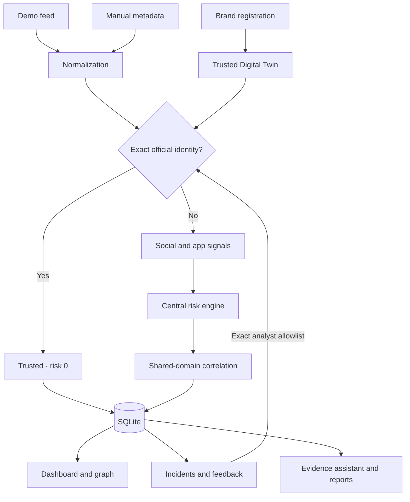

# BrandShield AI

**Explainable Digital Risk Protection for Social & App Impersonation**

A local hackathon prototype for the Digital Risk Protection Platform challenge. It registers a brand's legitimate identity, compares social and app metadata against it, and shows the evidence behind every triage decision.

The complete demo runs on one laptop. It does not need a paid LLM, a cloud database, or social-platform credentials. Install dependencies and build the frontend before going offline.

## Why this problem

A copied logo or familiar username can make an unofficial account look credible. The useful question is not just whether two names are similar. An analyst needs to know whether the asset is registered, which signals are concerning, and what to check next. That is the workflow this project implements.

The interface has nine working views: Dashboard, Trusted Digital Twin, Social Monitoring, App Monitoring, Analyze Asset, Threat Graph, Incidents, Investigation Copilot, and System / Architecture.

## Working now, demo data, and future work

| Working now | Demo data | Future work |
| --- | --- | --- |
| Brand registration and editing in SQLite | Fictional Northstar brand and generated shield logo | Authenticated social and app-store connectors |
| Exact official-identity exclusions | 26 candidate records for the default brand | Collection provenance and signed evidence |
| Real fuzzy-name and look-alike comparisons | Candidate bios, descriptions, publishers and URLs | Multi-user authentication and authorization |
| Real local logo average-hash comparison | Candidate logos are intentionally reused in fixtures | Better visual detection and labeled evaluation |
| Central score with visible contributions | Domains use reserved `.example` addresses | Calibrated model confidence and broader Unicode coverage |
| Shared-domain correlation and interactive graph | Scan adapts the fixture names to the selected brand | Production ingestion, queues and rate limits |
| Evidence-template copilot, incidents and reports | No live monitoring or platform verification | Optional LLM narration grounded in saved evidence |

The word “AI” is part of the project name. The current engine is deterministic heuristics; the copilot uses templates, not a generative model. There are no fabricated similarity percentages or random risk values. The app never follows a candidate URL or performs a takedown.

## Quick start — Windows PowerShell

Install Python 3.12 and Node.js 22 or newer. Open PowerShell in the extracted `brandshield-ai` folder. These commands do not require activating a virtual environment or changing the execution policy.

```powershell
py -3.12 -m venv .venv
.\.venv\Scripts\python.exe -m pip install -r requirements.txt
npm --prefix frontend ci
npm --prefix frontend run build
.\.venv\Scripts\python.exe -m uvicorn backend.main:app --host 127.0.0.1 --port 8000
```

Open **http://127.0.0.1:8000**. Keep the terminal running. Stop with Ctrl+C.

After the first setup, run only the last command. The SQLite database initializes automatically at `backend/data/brandshield.db`. The first start creates the demo brand, but no findings are shown until you run a scan or manual analysis.

## Quick start — macOS / Linux

```bash
python3 -m venv .venv
.venv/bin/python -m pip install -r requirements.txt
npm --prefix frontend ci
npm --prefix frontend run build
.venv/bin/python -m uvicorn backend.main:app --host 127.0.0.1 --port 8000
```

Run these commands from the project root. The source archive deliberately excludes dependencies, the local database, and generated build output. Build once while online; the running demo then needs no internet access.

### Development

Run the API as above in one terminal. In another:

```bash
npm --prefix frontend run dev
```

Vite prints the local development URL (normally http://127.0.0.1:5173) and proxies `/api` to port 8000. Production build output is served by FastAPI so the main demo uses one origin and one port. Navigation uses hashes, so refresh and back/forward work without server-side route rewrites.

## Trusted Digital Twin and false positives

The twin is a structured registry: brand name, logo, website, domains, platform-scoped handles, app/store identifiers, official developers, name variations and contextual keywords.

1. A social account is official only when its **platform and exact handle** match a registered identity (case-insensitive, leading `@` ignored).
2. An app is official only when its **store, exact package/store identifier, and developer** match a registered application.
3. Exact official matches get risk **0**, status **TRUSTED**, and “Verified against Trusted Digital Twin.”
4. A publisher name alone or a link to the official website does not grant trust. Both can be copied by an attacker.
5. Similarity without independent support is capped at 19. Unrelated assets do not receive keyword, publisher or domain penalties.
6. Analysts can save a reasoned false-positive decision. That exact identity is allowlisted until the analyst removes it. Feedback survives rescans and restarts.
7. Editing a brand recalculates its stored findings. Incident evidence snapshots remain unchanged.

Trust here means a match to the user-entered registry, not independent proof of account ownership. The manual lab accepts analyst-supplied metadata. Production collection would need to verify that metadata at its source.

## Detection logic

### Social profiles

The engine compares the username with the brand and official handles, and the display name with brand names. It also considers brand mentions in the bio, service/promotion terminology, an external linked domain, and visual similarity when both logos exist. Username and display-name similarities share one identity contribution; they are not separately counted twice.

### Applications

App names are compared with brand names and registered app names. Developer mismatch, separate brand usage in the description, service/promotion terminology, external links and logo structure provide supporting evidence. An exact official app is excluded before adding risk signals. A known publisher reduces concern, but an unknown package is still not automatically trusted.

### Look-alikes

`lookalike_detector.py` applies Unicode NFKC, case folding, a small explicit character map (`0→o`, `1→i`, `3→e`, `4→a`, `5→s`, `7→t`, and selected Cyrillic look-alikes), and removes punctuation/spacing. RapidFuzz `ratio` compares the normalized candidate against references. A second comparison removes known service additions such as `support`, `official`, and `rewards`. The highest real ratio is retained. Threshold: **72%**.

This catches character swaps, removed characters, punctuation changes and supported added words. It is intentionally not a complete Unicode-confusable or multilingual detector. Names can be entered with spacing; social *handles* reject spaces because those platforms normally do not accept them.

### Visual evidence

Pillow decodes uploaded PNG/JPEG/WebP images (up to 1 MB), converts to grayscale, resizes to 8×8, and compares the 64 average-hash bits. At least 90% bit agreement contributes visual evidence. Uniform images are ignored. Invalid images return a readable error. Images above 16 million pixels are rejected.

This is coarse shape agreement, not a probability of logo copying. Grayscale discards color; simple symbols can collide. The demo uses real image comparison on intentionally copied fixture logos, not seeded similarity numbers. No remote image fetch is needed.

## Risk and confidence

All score calculations live in `backend/services/risk_engine.py`; change `WEIGHTS` there.

| Signal | Contribution | Gate |
| --- | ---: | --- |
| Identity similarity | `round(30 × similarity / 100)` | Similarity ≥72% |
| Separate brand usage | +12 | Brand/name variation appears in bio or description |
| Publisher mismatch | +20 | Brand-related app; developer not registered |
| Logo structure | +18 | Actual hash agreement ≥90% |
| Supporting terminology | +5 per matched term, max +10 | Brand-related asset |
| Non-official linked domain | +20 | Brand-related asset; exact hostname/subdomain boundary check |
| Single-signal safeguard | Negative adjustment to 19 | Exactly one positive signal |
| Maximum score adjustment | Negative adjustment to 100 | Raw sum exceeds 100 |
| Official or analyst exclusion | 0 | Exact registered or allowlisted identity |

**Relatedness gate:** normalized identity similarity ≥72%, a brand mention in supplied text, or ≥90% logo agreement. This prevents an unrelated app from receiving points just for having a different developer or website. Absence from the official list is not a standalone score penalty.

The detail drawer shows every positive contribution and any negative cap adjustment. They sum exactly to the displayed risk.

| Score | Severity |
| ---: | --- |
| 0–19 | Very low |
| 20–39 | Low |
| 40–59 | Medium |
| 60–79 | High |
| 80–100 | Critical |

Confidence is a separate **evidence-support heuristic**:

```text
coverage = populated analysis fields / possible analysis fields
support = min(1, sum(strength of each positive signal) / 4)
confidence = round(100 × (0.60 × coverage + 0.40 × support))
```

Social fields: username, display name, bio, URL, logo. App fields: name, developer, description, package, URL, logo. Identity strength uses its ratio; visual strength uses bit agreement; keyword strength uses points / 10. Other qualifying signals have strength 1. Exact registry and analyst-allowlist matches show 100% **match confidence**. This is not statistical confidence or a calibrated probability of maliciousness.

Priority is independent from the numeric score: P1 for risk ≥80 or a credential lure at risk ≥60; P2 for other risk ≥60; P3 for risk ≥20; P4 otherwise. A P3 finding in a shared-domain campaign is promoted to P2 without changing its risk score. Credential-related words require a non-official link; words alone do not trigger that priority rule.

## Correlation and graph

Two or more suspicious findings for the same brand that link to the **same exact non-official hostname** form a possible campaign. Paths do not matter; different hostnames are not merged. Names alone do not create relationships. Correlation changes priority where applicable, not risk.

The graph shows the trusted brand, registered observed assets, suspicious social/app assets, linked domains and possible campaigns. Clicking an asset opens its evidence drawer. The default graph focuses on campaigns; switch off the filter to see individual official and suspicious assets.

This is shared-infrastructure evidence, not proof that all assets have the same operator. It does not resolve DNS, hosting providers, registered-domain ownership or URL redirects.

## Architecture



FastAPI validates input with Pydantic. SQLite stores typed record families as JSON with `(kind, id)` uniqueness; this is a deliberate small-project choice rather than an ORM. Parameterized SQL is used throughout. Each scan/update is transactional, and stable identity keys make repeated scans upserts. SQLite WAL mode and a connection timeout handle short overlapping requests.

Findings retain full metadata, signal contributions, timestamps, confidence basis, source label, classification, priority and campaign ID. Incidents retain a finding snapshot, status, notes and action history. False-positive feedback retains the original finding and analyst reason. No secret or API key is required.

## Challenge coverage

| Requirement | Where to demonstrate |
| --- | --- |
| Brand profile, logo and legitimate identity | Trusted Digital Twin |
| Social monitoring and fake profiles | Social Monitoring, Analyze Asset |
| App monitoring and publisher mismatch | App Monitoring, Analyze Asset |
| Official assets excluded | Load official examples → risk 0 |
| Look-alike detection | `n0rthst4r` and `_support_verify` fixtures |
| Evidence and scoring | Finding detail → Score breakdown |
| Graceful source unavailability | System / Architecture → Source health |
| Architecture deliverable | This README and architecture page |
| Stable demonstration | 26-row local feed, idempotent scans |
| Additional innovation | Graph, correlation, copilot and incidents |

## Tests

From the project root, with dependencies installed:

```powershell
# Windows: all checks, including build, real HTTP API, DOM UI and process restart
.\.venv\Scripts\python.exe scripts\verify.py
# Backend tests only
.\.venv\Scripts\python.exe -m pytest backend/tests -q
```

```bash
# macOS / Linux
.venv/bin/python scripts/verify.py
.venv/bin/python -m pytest backend/tests -q
```

The full check creates a temporary SQLite database and chooses a temporary local port. It does not modify your demo database. The DOM test exercises the actual API. It covers all navigation pages, trusted social/app exclusions, a suspicious app, graph node clicks, the copilot, brand creation, incident changes, report rendering, and runtime errors in that DOM environment. The process-restart check compares saved incident records before and after restarting Uvicorn.

The backend regressions cover 29 cases, including look-alike variations, deterministic scoring/bounds, exact trust boundaries, independent-signal control, unrelated assets, real image-hash comparison, domain boundaries, invalid input, rescan idempotency, correlation, feedback, incident snapshots, brand edits and API errors.

**Verification limit:** DOM tests are not a browser. Responsive layout, graph geometry, actual file-picker interaction, PDF pagination and browser console behavior must still be checked in Chrome/Edge. See `docs/QA_CHECKLIST.md`. The commands were executed on Linux with Python 3.12 and Node 24; Windows setup is provided but was not executed in this environment.

## Three-to-five-minute demo

Use the default fictional **Northstar** brand so nobody mistakes the fixture records for real accusations. Full script: `docs/DEMO.md`.

1. **0:00–0:35 — Define reality.** Open Trusted Digital Twin: official handle `northstar`, app `com.northstar.mobile`, developer `Northstar Labs`, logo and `northstar.example`.
2. **0:35–1:10 — Prove trust.** Analyze Asset → Load official example → Analyze. Show risk 0. Repeat in Mobile application mode.
3. **1:10–2:05 — Detect and explain.** Load suspicious social and app examples. Show normalized similarity, independent evidence, publisher mismatch, risk contributions and confidence explanation.
4. **2:05–2:40 — Monitor and connect.** Run demo scan. Open Dashboard and Threat Graph. Show a social profile and app connected through `rewards-check.example`.
5. **2:40–3:20 — Investigate.** Open Investigation Copilot, select a finding, ask for strongest evidence and next action. Explain that it uses saved evidence templates.
6. **3:20–4:10 — Respond.** Create an incident from a finding. Change it to Investigating, add notes, save, refresh, and show persistence. Generate a printable evidence report.
7. **4:10–4:30 — Architecture and boundary.** Show the pipeline and source-health panel. State clearly that sources are simulated and detection is working locally.

## Important source files

```text
brandshield-ai/
  backend/
    main.py                         API routes, transactions and record orchestration
    models.py                       Validated brand, candidate and incident schemas
    database.py                     SQLite connection and record storage
    seed.py                         Fictional brand, logo and candidate fixtures
    services/
      trusted_asset_service.py      Exact trust and domain boundary checks
      lookalike_detector.py         Normalization and RapidFuzz similarity
      visual_detector.py            Real average-hash logo comparison
      risk_engine.py                Central weights, evidence, risk and confidence
      correlation_engine.py         Evidence-based campaign relationships
      explanation_service.py        Copilot templates grounded in findings
    tests/test_system.py            API and detector regressions
  frontend/
    src/
      main.jsx                      App shell, routing and API state
      api.js                        Consistent request/error handling
      components/                   Shared controls, evidence drawer and report
      pages/                        Nine views (social/app share Monitoring)
      styles.css                    Responsive analyst-workspace styling
    tests/ui-smoke.mjs               DOM integration checks against the real API
    package.json, package-lock.json Locked frontend dependencies
    vite.config.js                  React build and development API proxy
  scripts/verify.py                  Build, HTTP, DOM and restart checks
  docs/                             Demo script, QA checklist and engineering report
  requirements.txt                  Exact Python dependency versions tested
  start.ps1, start.sh                Post-setup local launch helpers
```

Interactive API documentation is available at http://127.0.0.1:8000/docs while the server runs. Key endpoints include `/api/brands`, `/api/analyze/social`, `/api/analyze/app`, `/api/demo/scan`, `/api/findings`, `/api/campaigns`, `/api/graph`, `/api/dashboard`, `/api/incidents`, `/api/copilot/{finding_id}` and `/api/reports/{finding_id}`.

## Known limitations and roadmap

- No live platform connectors, verified ownership, automatic takedowns, authentication or multi-tenant separation. Keep the server on localhost. This is an analyst prototype, not a production security service.
- Similarity thresholds and weights have not been evaluated against a labeled real-world benchmark. Fan pages, resellers, common names and short brands may need analyst review.
- Publisher matching is case-insensitive exact matching of supplied text. An attacker can claim a legitimate name in unverified input; a real connector must establish provenance.
- An allowlist covers the exact asset identity even if later metadata changes. Analysts must remove the allowlist to resume scoring. Changing an incident away from False Positive does not silently remove it.
- Brand keywords are saved for context, but do not independently increase risk. No follower counts or account-age signals are invented.
- Demo scans overwrite stored metadata for matching fixture identities. Changes to brand names can produce new generated fixture identities; scans of an unchanged brand are idempotent.
- The SQLite JSON-record approach suits a small demo. There is no migration framework, pagination, evidence signing or large-feed ingestion.
- The browser has not been visually tested in this build environment. The supplied manual checklist is still required before presenting.

## Team

Add your real team name, members and contributions before submission. No team identities or development history have been invented. Be prepared to explain the four key modules: trust, look-alikes, risk, and correlation.
